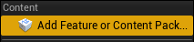
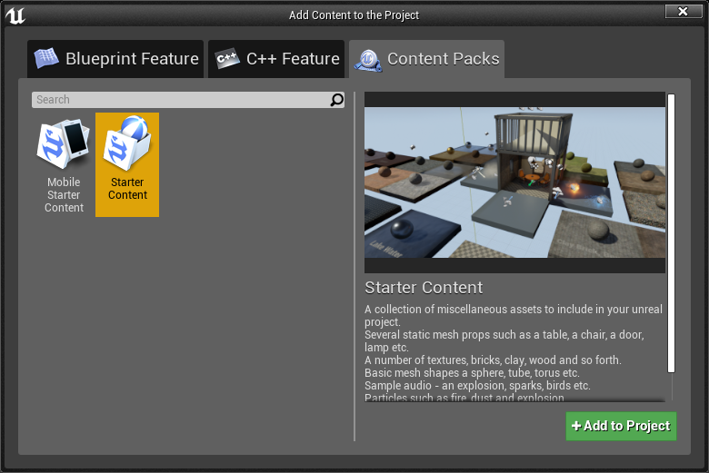

## Starter Content

* This project requires the UE4 Starter Content.

* In the `Content Browser` click `Add New` and select `Add Feature or Content Pack...`

* Select `Starter Content` in `Content Packs` and `Add to Project`

